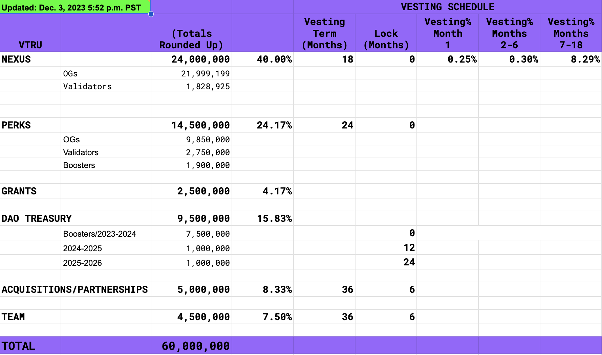

# VEP-1 ♦︎ Cap Table Realignment

### Abstract

Investor prospects and exchange listing advisors have raised concerns about two aspects of the current Vitruveo Cap Table:&#x20;

1\) Tremendous sell pressure at Month 7 due to vesting that would adversely affect the price of $VTRU, and&#x20;

2\) Lack of sufficient reserves in the Treasury for additional funding rounds.&#x20;

The proposed mitigation is to reduce the OG allocation to roughly half by giving existing investors the opportunity to swap $VTRU for $VTRO (the DEX token).

### Description

The current Vitruveo Cap Table has an allocation called "Nexus" which is a combined allocation for OGs (original retail investors) and Validators. The investor prospects and exchange listing advisors have highlighted two areas of concern with the Cap Table:\
\
1\) At the end of Month 7, there will be approximately 1.76 million coins that simultaneously become available due to vesting. The holders are primarily retail investors, a majority of whom would like to sell their position. Due to this tremendous sell pressure, any gains on the coin price in the prior six months are likely to be instantly eroded.

2\) After the current round of funding is complete, the n/DAO will have approximately 2 million coins in the Treasury (plus any rebased coins). Investors are concerned that there are not enough coins for follow-on funding required for the growth of the protocol and organization.&#x20;

<figure><figcaption></figcaption></figure>

The proposed solution is to reduce the OG allocation by approximately 50% and move these coins to the Treasury as a future reserve. In order to do this, it is necessary to provide commensurate value for the coins being swapped to the holders. The proposal to provide this value is as follows:

**(NOTE: Modified since presentation to community on Dec. 8 based on community feedback.)**\
\
1\) Swap 1:2 locked/vested $VTRU with unlocked/fully vested $VTRO DEX token

2\) Make available 0.05% of the future DEX trade fee of 0.30% as income to any $VTRO holders who stake their tokens.

3\) Give existing $VTRU holders to swap any amount from 0% to 50% of their $VTRU holdings to $VTRO by making their choice in a dapp. Holders will have six days to make their decision.

4\) Any $VTRU holder who does not register their choice will automatically have 50% of their $VTRU converted to $VTRO

The proposed Cap Table for $VTRO is as follows:

<figure><figcaption></figcaption></figure>

The following are notable items about this Cap Table:\
\
1\) VTRO investors (formerly OOXY) are due approximately 300,000 tokens. The revised Cap Table adds a multiplier in order to scale these tokens up to millions.

2\) Not all 22 million $VTRU tokens are likely to be allocated. The balance will go to the DAO to fund ongoing maintenance of the DEX.

### Swap Mechanics

In order for $VTRU holders to consider this swap, the $VTRO token and the proposed swap mechanics must be favorable. Here are the benefits for $VTRU holders:

1\) The DAO will create a program named VTRU Scape to make it very easy for Arts Organizations such as galleries and museums to launch their own token. This will generate substantial DEX activity on Vitruveo.

2\) The current value of $VTRU is $1.50. The initial value of $VTRO is estimated to be $0.50 resulting in an initial market cap of $22.5 million.

3\) The swap of 1:2 $VTRU:$VTRO is fair because the price differential of $0.50 accounts for $VTRO being fully vested, versus $VTRU being on an 18-month vesting schedule.

4\) $VTRU will rebase over 5 years. However, in order to benefit from the rebase, a $VTRU holder would have to hold the coin for that period. For long-term holders this is a valid concern, but for most short-term holders this is offset slightly by the DEX fee income also rebasing.

Ultimately a $VTRU holder has to decide whether $VTRU or $VTRO gives them the best avenue for long-term profitability. Each investor has to make their own decision based on the available information and their estimate of projected DEX usage.

### Liquidity

Liquidity for both $VTRU and $VTRO is contingent on reaching our fundraising soft target of $3 million, and improves on reaching our stretch goal of $5 million. Liquidity for each listing will be driven by capital raised and exchange guidance.

The sequence of events would be as follows:\
\
1\) $VTRO listing on CEX at starting price of $0.50

2\) $wVTRU listing on CEX at starting price floor $1.50, ceiling $3.00

### Voting

It is not necessary for the community to vote on this proposal. Using a dapp to set their swap threshold to 0% or some higher percentage is analogous to a NO or YES vote. Thus, enabling the community to choose their swap amount is a replacement for voting.

### Summary

$VTRU coin holders are being asked to specify what percentage of their holdings they want to swap 1:2 for $VTRO tokens. $VTRO token holders who stake their tokens will be eligible for 0.05% of the DEX 0.30% trading fees for all transactions. Additionally, unlike the $VTRU coins, the $VTRO tokens will be fully unlocked and transferable.

